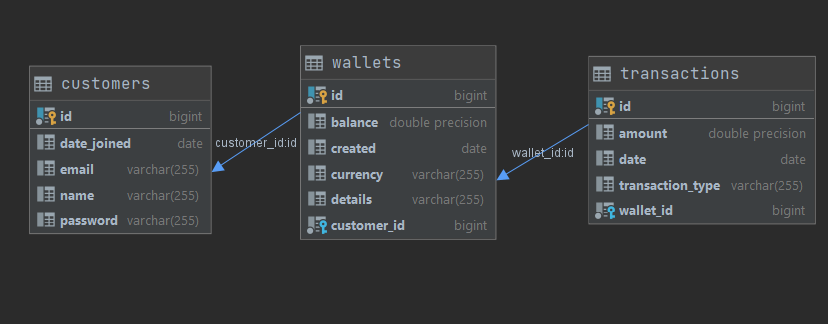

# EWallet-Api

## Description

Implement e-wallet with REST API to create it, top it up, check its balance and withdraw funds using Spring Boot. Funds on any wallet should
not go below zero. The project  built with Gradle.

### Requirements:

- Docker-Compose 1.28
- Gradle 6.8
- Java 11

### Starting(Application has to be run with dev profile):

Step 1: run `docker-compose up` as a terminal command in the root of Project/repository

Step 2:

- run `gradle bootRun --args='--spring.profiles.active=dev' --stacktrace` in the root of repository        
  OR:
- Open in IntelliJ, add 'dev' to active profiles and run ApiApplication

### Swagger API Documentation

[http://localhost:8284/swagger-ui.html](http://localhost:8284/swagger-ui.html)
